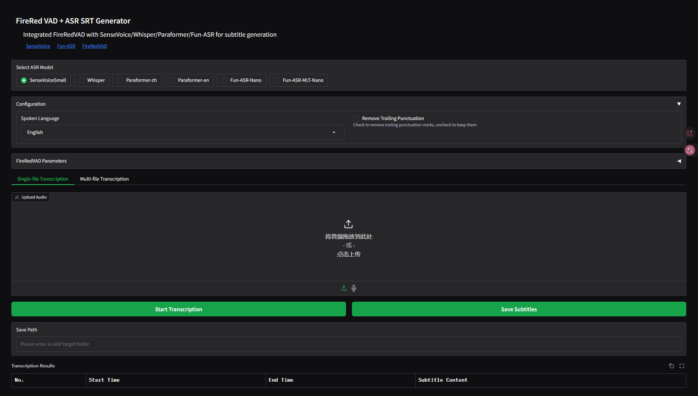

# <div align="center">FireRedVAD-ASR-SRT 🎙️🎬</div>

<div align="center">

[](https://python.org)
[](LICENSE)
[](https://github.com/FunAudioLLM/SenseVoice)
[](https://github.com/FunAudioLLM/SenseVoice)

</div>

<div align="center">

**Advanced Speech Recognition and Subtitle Generation Tool**

</div>

Integrated FireRedVAD with multiple ASR models, supporting single-file or batch SRT subtitle generation.

[中文](README_ZH.md) | [English](README.md) | [日本語](README_JA.md)

---

## 🌟 Core Features

- 🎯 **Multi-model Support**: SenseVoiceSmall, Whisper, Paraformer, Fun-ASR-Nano, Fun-ASR-MLT-Nano
- 🎭 **Multi-language Interface**: English, Chinese, Japanese (easily extensible)
- 📝 **Batch Processing**: Single-file or batch transcription
- ⚡ **High Performance**: Optimized for both CPU and GPU acceleration
- 🎛️ **Flexible Configuration**: Adjustable VAD parameters and model settings
- 📊 **Rich Output**: SRT subtitle format with timestamps

## <div align="center">🚀 Quick Start</div>

### 1. Environment Setup

Use **uv** to create a virtual environment (recommended):

```bash
uv venv --python 3.12
```

### 2. Install Dependencies

Install using uv:

```bash
uv pip install -r requirements.txt
# or
uv sync
```

### 3. Model Configuration

#### Download and configure models:

- **SenseVoiceSmall**: Automatically downloads with `disable_update=True`
- **Whisper**: Requires additional installation: `uv pip install -U openai-whisper`
- **VAD Model**: FireRedVAD, placed in `.pretrained_models/` by default

### 4. Hardware Acceleration

#### 🎮 NVIDIA GPU (CUDA):

```bash
uv pip install torch torchaudio --index-url https://download.pytorch.org/whl/cu126
```

#### 💻 CPU Only:

```bash
uv pip install torch torchaudio --index-url https://download.pytorch.org/whl/cpu
```

### 5. Run the Application

```bash
uv run main.py
```

## 🌐 Multi-language Support

The application automatically detects system language:

- 🇺🇸 **English**: Automatically switches to English interface
- 🇨🇳 **Chinese**: Automatically switches to Chinese interface
- 🇯🇵 **Japanese**: Automatically switches to Japanese interface
- ➕ **Easy to Extend**: Simply add a JSON file in `locales/` to support new languages

### Language Options

#### Force a specific language:

```bash
uv run main.py --lang=en    # English interface
uv run main.py --lang=zh    # Chinese interface
uv run main.py --lang=ja    # Japanese interface
```

## 📁 Project Structure

```
FireRed/
├── 📄 main.py                 # Main program
├── 📁 utils/                  # Utility modules
│   └── 🌐 translator.py        # Multi-language support
├── 📁 locales/                # Language translations
│   ├── 🇺🇸 en.json          # English
│   ├── 🇨🇳 zh.json          # Chinese
│   └── 🇯🇵 ja.json          # Japanese
├── 📁 tools/                  # Fun-ASR tools
├── 📄 model.py                # Fun-ASR model code
├── 📄 ctc.py                  # CTC module
├── 📄 pyproject.toml          # Project configuration
├── 📄 README.md              # This file
├── 📄 README_ZH.md           # Chinese version
└── 📄 README_JA.md           # Japanese version
```

## 🎯 Usage Tips

> **Important**: When performing batch transcription, always try single-file transcription first to find the optimal VAD parameters and ensure accurate sentence segmentation.

### Workflow:

1. **Single-file Test**: Find the best settings
2. **Batch Processing**: Apply settings to multiple files
3. **Quality Check**: Review generated subtitles
4. **Export & Save**: Save to the specified location

## 🤝 Contributing

We welcome all kinds of contributions! Feel free to:

- 🐛 Report bugs
- 💡 Suggest features
- 🌍 Add translations
- 🔧 Improve code

## 📄 License

This project is open-sourced under the MIT License - see the [LICENSE](LICENSE) file for details.

## 🙏 Acknowledgments

- [FireRedVAD](https://github.com/FireRedTeam/FireRedVAD) - Voice Activity Detection
- [Fun-ASR](https://github.com/FunAudioLLM/Fun-ASR) - Speech Recognition
- [SenseVoice](https://github.com/FunAudioLLM/SenseVoice) - Speech Recognition
- [OpenAI Whisper](https://github.com/openai/whisper) - Speech Recognition
- [Gradio](https://gradio.app/) - Web Interface Framework

## 📸 Interface Preview


